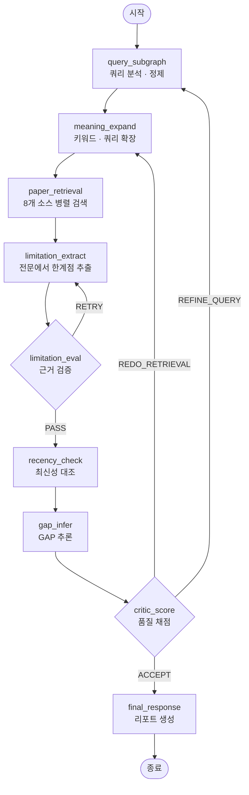

<div align="center">


# GAPAGO

**연구 GAP 분석 멀티 에이전트 시스템**

연구 주제를 입력하면 논문을 자동 수집하고, 각 논문의 한계점(limitation)을 원문에서 추출한 뒤,
아직 해결되지 않은 한계점만 골라 **연구 공백(research gap)** 과 후속 연구 방향을 제안합니다.

LangGraph · FastAPI · Multi-LLM Routing

</div>

---

## 목차

- [무엇을 하는가](#무엇을-하는가)
- [파이프라인](#파이프라인)
- [빠른 시작](#빠른-시작)
- [환경 변수](#환경-변수)
- [실행 방법](#실행-방법)
- [API](#api)
- [프로젝트 구조](#프로젝트-구조)
- [핵심 설계](#핵심-설계)
- [배포](#배포)
- [문서](#문서)

---

## 무엇을 하는가

일반적인 LLM에게 "이 분야의 연구 공백을 알려줘"라고 물으면 그럴듯하지만 근거 없는 답이 돌아옵니다.
GAPAGO는 그 대신 **실제 논문 원문에서 출발**합니다.

| 단계 | 하는 일 |
|---|---|
| **1. 쿼리 정제** | 모호한 연구 주제를 검색 가능한 쿼리로 변환. 너무 넓거나 좁으면 사용자에게 되물음 |
| **2. 논문 검색** | arXiv · Crossref · Semantic Scholar · OpenAlex · ScienceON · Tavily 8개 소스 병렬 검색 |
| **3. 한계점 추출** | **초록이 아닌 전문(full text)** 에서 한계점 추출. 전문 확보 실패 논문은 후보 논문으로 교체 |
| **4. 품질 평가** | 추출된 한계점이 원문에 실제로 근거하는지 원자 단위로 검증. 미달 시 재추출 |
| **5. 최신성 확인** | 웹 검색으로 "이미 누가 풀었는지" 대조. 해결된 한계점은 GAP 후보에서 제외 |
| **6. GAP 추론** | 남은 한계점을 도메인 축으로 묶고, 기술적 장벽을 분석해 연구 방향 제안 |
| **7. 리포트** | 근거 논문 인용이 포함된 5개 섹션 마크다운 리포트 생성 |

각 단계는 품질 게이트를 통과하지 못하면 이전 단계로 되돌아갑니다.

---

## 파이프라인



> 상세 다이어그램: [`docs/assets/graph_full.png`](docs/assets/graph_full.png),
> [`docs/assets/pipeline_architecture.drawio`](docs/assets/pipeline_architecture.drawio)

### 두 가지 실행 모드

| 모드 | 활성화 | 동작 |
|---|---|---|
| **고정 파이프라인** (기본) | — | 위 그래프대로 정해진 순서 실행 |
| **오케스트레이터** | `GAPAGO_ORCHESTRATOR=1` | LLM이 매 스텝 state를 보고 다음 에이전트를 동적 결정. 품질 게이트(eval/recency/critic)를 필요할 때만 삽입 |

---

## 빠른 시작

### 사전 요구사항

- Python **3.10+** (배포 기준 3.10.12)
- Node.js **20+** (랜딩 페이지 빌드용, 선택)
- LLM provider API 키 1개 이상 ([환경 변수](#환경-변수) 참조)

### 설치

```bash
git clone https://github.com/Coding-Maengsu/AI-Co-Scientist-Challenge-New.git
cd AI-Co-Scientist-Challenge-New

python -m venv .venv && source .venv/bin/activate

# 로컬 개발 / HPC (GPU 리랭킹 포함)
pip install -r requirements.txt

# 또는 클라우드 배포용 경량 (CPU 전용 PyTorch)
pip install -r requirements_deploy.txt
```

### 환경 설정

```bash
cp .env.example .env
# .env 파일을 열어 사용할 provider의 키를 채웁니다
```

### 실행

```bash
# 웹 서버 (권장)
uvicorn api.main:app --reload --port 8000
# → http://localhost:8000      랜딩 페이지
# → http://localhost:8000/app  분석 앱

# CLI 대화형
python main.py

# CLI 1회 실행
python scripts/run_once.py "저자원 언어 기계번역의 한계"
```

---

## 환경 변수

`.env` 파일에 설정합니다. **최소 1개의 LLM provider**와 `TAVILY_API_KEY`가 필요합니다.

### LLM Provider (1개 이상 필수)

| 변수 | 설명 |
|---|---|
| `LLM_PROVIDER` | 기본 provider — `azure` \| `claude` \| `gemini` \| `groq` \| `exaone` \| `qwq` |
| `AZURE_OPENAI_API_KEY` / `_ENDPOINT` / `_DEPLOYMENT` / `_API_VERSION` | Azure OpenAI (GPT) |
| `AWS_ACCESS_KEY_ID` / `AWS_SECRET_ACCESS_KEY` / `AWS_REGION` | Claude via AWS Bedrock |
| `BEDROCK_CLAUDE_MODEL` | Bedrock 모델 ID (기본 `us.anthropic.claude-sonnet-4-20250514-v1:0`) |
| `GROQ_API_KEY` / `GROQ_MODEL` | Groq (기본 `qwen/qwen3-32b`) — 추론 단계용 |
| `GOOGLE_API_KEY` / `GOOGLE_CLOUD_PROJECT` / `GOOGLE_CLOUD_LOCATION` | Google Gemini (Vertex AI) |
| `EXAONE_MODEL_PATH` / `QWQ_MODEL_PATH` | 로컬 GPU 모델 경로 |

### 검색 소스

| 변수 | 필수 | 설명 |
|---|:--:|---|
| `TAVILY_API_KEY` | ✅ | 웹 검색 (최신성 확인에 사용) |
| `SCIENCEON_CLIENT_ID` / `SCIENCEON_MAC_ADDRESS` / `SCIENCEON_KEY` | | 한국 ScienceON 논문·특허·보고서 |

### 파이프라인 튜닝 (선택)

| 변수 | 기본값 | 설명 |
|---|:--:|---|
| `ARXIV_MAX_RESULTS` | 20 | arXiv 최대 수집 편수 |
| `TAVILY_MAX_RESULTS` | 5 | Tavily 결과 수 |
| `FULLTEXT_TARGET_COUNT` | 30 | 전문 필터링 후 유지 논문 수 |
| `BM25_TOP_K` | 50 | BM25 1차 필터 수 |
| `RERANKER_TOP_K` | 15 | 리랭커 2차 선별 수 |
| `RERANK_MODELS` | `auto` | `light`(MiniLM, CPU) \| `full`(SPECTER2+BGE) \| `auto` |
| `GAPAGO_ORCHESTRATOR` | `0` | `1`이면 오케스트레이터 모드 |

### 관측 (선택)

| 변수 | 설명 |
|---|---|
| `LANGSMITH_TRACING` / `LANGSMITH_API_KEY` / `LANGSMITH_PROJECT` | LangSmith 트레이싱 |

---

## 실행 방법

### 웹 서버

```bash
uvicorn api.main:app --host 0.0.0.0 --port 8000
```

랜딩 페이지를 함께 빌드하려면:

```bash
cd landing && npm install && npm run build && cd ..
```

> `landing/dist/`가 없으면 루트(`/`)는 분석 앱(`frontend/index.html`)으로 자동 fallback 합니다.

### CLI

```bash
python main.py                          # 대화형 (provider·모드 선택, 결과 후속 질의응답 지원)
python scripts/run_once.py "연구 주제"    # 비대화형 1회 실행
```

### 스크립트

| 명령 | 용도 |
|---|---|
| `python scripts/evaluate.py --result-file outputs/gapago_result_*.json` | GAPAGO 결과 vs 단일 LLM baseline 비교 평가 |
| `python scripts/compare_modes.py "연구 주제"` | 고정 파이프라인 vs 오케스트레이터 모드 비교 |
| `python scripts/test_timing.py` | 단계별 소요 시간 측정 |
| `python scripts/test_gemini.py` | Gemini 연결 확인 |

### 테스트

```bash
pytest tests/
```

---

## API

베이스 URL: `http://localhost:8000`

### 분석 실행

| 메서드 | 경로 | 설명 |
|---|---|---|
| `GET` | `/api/analyze` | 분석 시작 → `session_id` 반환 (백그라운드 실행) |
| `GET` | `/api/explore` | 이전 분석에서 제안된 주제로 후속 분석 (부모 세션에 연결) |
| `GET` | `/api/stream/{session_id}` | **SSE** 진행 상황 스트리밍 |
| `GET` | `/api/status/{session_id}` | 세션 상태 조회 |
| `GET` | `/api/stop/{session_id}` | 실행 중단 |
| `GET` | `/api/clarify` | 쿼리가 모호할 때(Human-in-the-Loop) 사용자 응답 전달 |
| `POST` | `/api/chat` | 완료된 분석 결과에 대한 후속 질의응답 |

`/api/analyze` 파라미터:

| 이름 | 기본값 | 설명 |
|---|:--:|---|
| `query` | *(필수)* | 연구 주제 |
| `provider` | `azure` | 기본 LLM provider |
| `routing_profile` | `optimized` | `optimized` \| `quality` |
| `fast_mode` | `false` | 속도 우선 모드 |
| `domain` | `auto` | 연구 도메인 |
| `year_range` | `auto` | 논문 연도 범위 |
| `output_language` | `auto` | 리포트 출력 언어 |
| `user_id` | `""` | 히스토리 분리용 식별자 |

### 히스토리 · 기타

| 메서드 | 경로 | 설명 |
|---|---|---|
| `GET` | `/api/history` | 분석 히스토리 목록 |
| `GET` | `/api/history/{filename}` | 개별 결과 조회 |
| `DELETE` | `/api/history/{filename}` | 결과 삭제 |
| `GET` | `/api/providers` | 사용 가능한 provider 목록 |
| `GET` | `/api/health` | 헬스 체크 |

**사용 흐름**: `/api/analyze` 호출 → 반환된 `session_id`로 즉시 `/api/stream/{session_id}` 구독 → 노드별 진행 이벤트 수신 → 완료 시 최종 리포트 수신.

---

## 프로젝트 구조

```
.
├── api/main.py              FastAPI 서버 — 배포 진입점 (SSE 스트리밍, 세션 관리)
├── main.py                  CLI 대화형 진입점
│
├── graphs/                  LangGraph 그래프 정의
│   ├── graph.py               고정 파이프라인 (기본)
│   ├── orchestrator_graph.py  동적 오케스트레이터 그래프
│   └── query_subgraph.py      쿼리 분석·정제 서브그래프
│
├── agents/                  에이전트 노드
│   ├── query_agent/           쿼리 분석(v3) · 정제(v2)
│   ├── meaning_expand_agent.py
│   ├── retrieval_agent.py     8소스 병렬 검색 + 3단계 리랭킹
│   ├── limitation_agent.py    전문 기반 한계점 추출 (최대 모듈)
│   ├── limitation_eval_agent.py  FActScore + Prometheus 품질 검증
│   ├── recency_agent.py       웹 검색 기반 최신성 대조
│   ├── gap_agent.py           동적 축 생성 + GAP 추론
│   ├── critic_agent.py        LLM-as-a-Judge 채점 · 라우팅
│   ├── response_agent.py      최종 리포트 생성
│   ├── gap_chat_agent.py      결과 후속 질의응답
│   └── orchestrator_agent.py  동적 라우팅 결정
│
├── tools.py                 검색 소스 통합 (arXiv/Crossref/S2/OpenAlex/ScienceON) + BM25
├── llm.py                   Provider 추상화 (azure/claude/gemini/groq/exaone/qwq)
├── model_router.py          에이전트별 모델 배정 프로파일
├── states.py                AgentState 및 Pydantic 스키마
├── config.py                환경 변수 기반 설정
│
├── utils/                   progress(SSE) · session_store(SQLite) · cancel · parse_json · tavily
├── prompts/system.py        공통 시스템 프롬프트
│
├── frontend/index.html      분석 앱 UI (단일 파일 SPA)
├── landing/                 랜딩 페이지 (React 19 + Vite + Tailwind)
│
├── scripts/                 평가 · 벤치마크 · 단발 실행 스크립트
├── tests/                   pytest 테스트
├── legacy/                  구 데모 UI (Streamlit · Gradio) — 현재 미사용
├── docs/                    specs · design · changelog · reports · archive · assets
└── outputs/                 분석 결과 JSON (gitignored)
```

---

## 핵심 설계

### 전문(full text) 기반 추출

한계점은 **논문 초록이 아닌 본문에서만** 추출합니다. 초록에는 한계점이 거의 기술되지 않기 때문입니다.
전문 확보는 8단계 폴백 체인(ar5iv HTML → arXiv PDF → DOI 랜딩 → Unpaywall → S2 Batch → PMC BioC → EuropePMC → 직접 PDF)을 거치며,
그래도 실패하면 해당 논문을 버리고 후보 풀에서 교체합니다. 결과는 `.cache/fulltext/`에 캐싱됩니다(성공 7일 / 실패 6시간 TTL).

### 3단계 검색 리랭킹

```
8소스 병렬 수집  →  BM25 (top-50)  →  임베딩 유사도 (FAISS)  →  CrossEncoder 정밀 리랭킹
```

CPU 환경에서는 MiniLM 계열 + ONNX Runtime으로, GPU 환경에서는 SPECTER2 + BGE Reranker v2-m3로 자동 전환됩니다(`RERANK_MODELS=auto`).
CrossEncoder는 최고 점수 대비 임계값과 점수 갭을 이용해 선별 편수를 15~25편 사이에서 동적으로 결정합니다.

### 근거 검증 (limitation_eval)

추출된 한계점을 원자적 사실로 분해해 원문 근거 여부를 개별 판정하고(FActScore), Groundedness·Specificity·Relevance 3축을 1~5점으로 채점합니다(Prometheus).
`weak/remove` 비율 50% 초과, 평균 groundedness 3.0 미만, 평균 fact_score 0.6 미만, diversity_score 2 이하 중 하나라도 해당하면 **재추출**로 되돌립니다.

### 모델 라우팅

에이전트마다 요구되는 능력이 다르므로 프로파일 기반으로 모델을 분산 배정합니다.

| 프로파일 | 배정 |
|---|---|
| `optimized` (기본) | 정확성 필수 작업(쿼리 분석·평가·최신성) → Azure GPT · 추론(gap) → Groq · 핵심 추출/응답 → Claude |
| `quality` | 핵심 작업(한계점 추출·평가·응답·검증) → Claude · 추론 → Groq · 나머지 → Azure GPT |

### Fast Mode

`fast_mode=true`이면 CrossEncoder 리랭킹을 건너뛰고(BM25+FAISS만 사용), `limitation_eval`의 원자 검증(Call 1)을 생략하며, GAP 추론 시 상위 3개 축만 분석합니다. 속도와 품질을 맞바꾸는 옵션입니다.

### Human-in-the-Loop

쿼리 분석 단계에서 주제가 `TOO_BROAD` 또는 `TOO_NARROW`로 판정되면 파이프라인이 인터럽트되어 사용자에게 되묻습니다.
웹에서는 `/api/clarify`, CLI에서는 프롬프트로 응답을 받아 재개합니다.

---

## 배포

[`render.yaml`](render.yaml) 기반 Render 배포를 지원합니다.

```yaml
buildCommand: cd landing && npm install && npm run build && cd .. && pip install -r requirements_deploy.txt
startCommand: uvicorn api.main:app --host 0.0.0.0 --port $PORT --workers 1
```

- `workers 1` 단일 프로세스 — 서버 기동 시 임베딩/리랭커 모델을 한 번만 로드해 재사용(메모리 절약 + 첫 요청 지연 제거)
- `RERANK_MODELS=light` — Render에는 GPU가 없으므로 MiniLM 계열 사용
- API 키는 Render Dashboard의 Environment에서 설정 (`render.yaml`에 커밋하지 않음)

---

## 문서

| 경로 | 내용 |
|---|---|
| [`docs/specs/`](docs/specs) | 에이전트 · API · 웹 · 한계점 시스템 상세 스펙, 팩트시트 |
| [`docs/design/`](docs/design) | 설계서 · 기능 요청서 · 메모리/비용 전략 |
| [`docs/changelog/`](docs/changelog) | 웹 메이저 업데이트 · 모델 라우터 변경 이력 |
| [`docs/reports/`](docs/reports) | 동적 k 검증 · 한계점 추출 실패 분석 · 웹 검색 활용 리포트 |
| [`docs/assets/`](docs/assets) | 파이프라인 다이어그램 |
| [`docs/archive/`](docs/archive) | 보관용 초안 · 완료된 TODO |

---

<div align="center">
<sub>AI Co-Scientist Challenge</sub>
</div>
