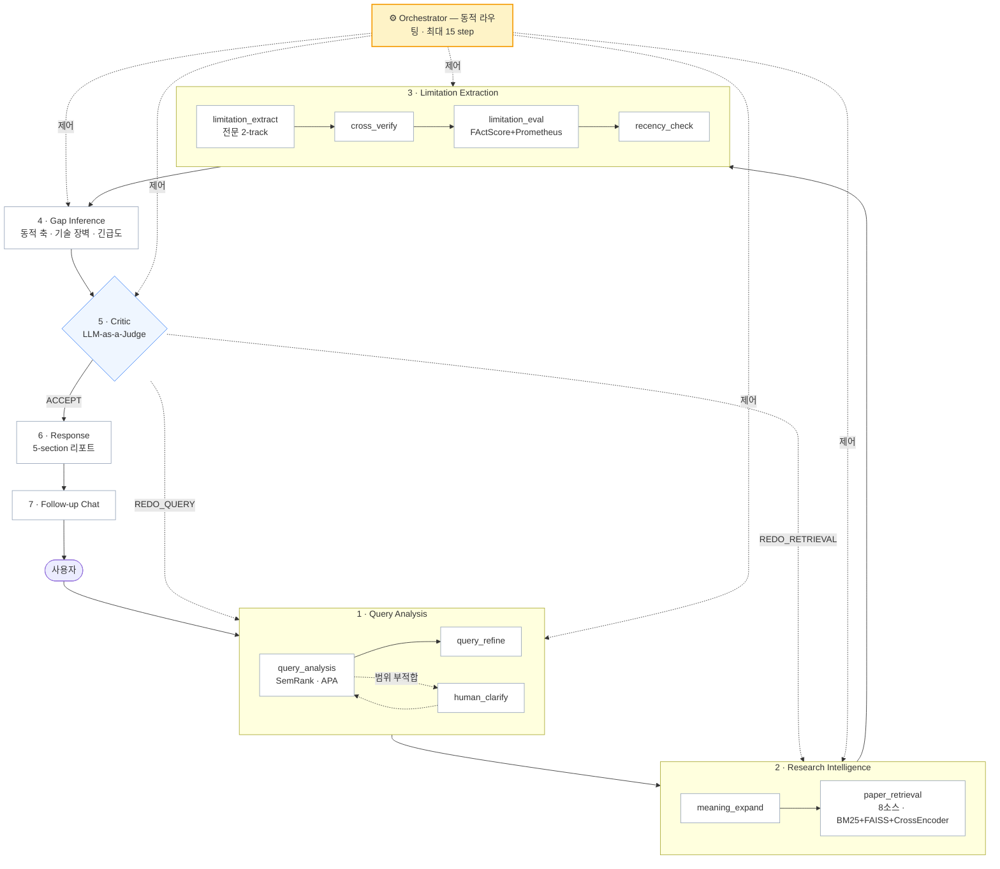

<div align="center">


# GAPAGO

**연구 논문에서 "아직 아무도 풀지 않은 문제"를 찾아내는 멀티 에이전트**

연구 주제를 입력하면 논문을 모으고, 각 논문 **본문에서** 한계점을 뽑고,
웹 검색으로 이미 해결된 것을 걸러낸 뒤, 남은 것들로 **연구 공백(research gap)** 과 후속 연구 방향을 제안합니다.

`LangGraph` · `FastAPI` · `Multi-LLM Routing`

[](https://webzine.nrf.re.kr/magazine/2605/sub9.php)
[](LICENSE)
[](pyproject.toml)

🏆 **2026 AI Co-Scientist Challenge Korea · Track 2 (AI Agent) 우수상**
과학기술정보통신부 주최 · 한국연구재단 주관 — 팀 **코딩맹수**

</div>

---

## 무엇을 하는가

일반 LLM에게 "이 분야의 연구 공백을 알려줘"라고 물으면 그럴듯하지만 근거 없는 답이 돌아옵니다.
GAPAGO는 **실제 논문 원문에서 출발**합니다.

| 단계 | 하는 일 |
|---|---|
| **1. 쿼리 정제** | 모호한 주제를 검색 가능한 쿼리로 변환. 너무 넓거나 좁으면 사용자에게 되물음 |
| **2. 논문 검색** | arXiv · Crossref · Semantic Scholar · OpenAlex · ScienceON(논문·특허·보고서) · Tavily 웹 — **8개 소스 병렬** |
| **3. 한계점 추출** | **초록이 아닌 전문(full text)** 에서 추출. 전문 확보 실패 논문은 후보로 교체 |
| **4. 근거 검증** | 추출된 한계점이 원문에 실제로 근거하는지 원자 단위로 검증. 미달 시 재추출 |
| **5. 최신성 확인** | 웹 검색으로 "이미 누가 풀었는지" 대조. 해결된 것은 후보에서 제외 |
| **6. GAP 추론** | 남은 한계점을 도메인 축으로 묶고, 기술적 장벽을 분석해 연구 방향 제안 |
| **7. 리포트** | 근거 논문 인용이 포함된 5개 섹션 마크다운 리포트 생성 |

각 단계는 품질 게이트를 통과하지 못하면 이전 단계로 되돌아갑니다.

## 데모

> 🎬 **시연 영상** — 준비 중
>
> <!-- 여기에 시연 영상 또는 GIF 를 넣으세요.
>      예) 
>          [](https://youtu.be/VIDEO_ID) -->

| | |
|---|---|
| 결과 리포트 예시 | *준비 중* — 5개 섹션(관련 논문 · 핵심 한계점 · GAP 개요 · 상세 분석 · Critic 점수) |
| 본심사 발표자료 | [`docs/presentation/GAPAGO_발표자료.pdf`](docs/presentation/GAPAGO_발표자료.pdf) |

---

## 빠른 시작

### 사전 준비

Python 3.10+ · LLM provider 키 1개 · `TAVILY_API_KEY`

```bash
git clone https://github.com/Coding-Maengsu/gapago.git
cd gapago
chmod +x run_agent.sh        # zip 다운로드 등으로 실행 권한이 없을 때
cp .env.example .env         # 아래 표를 보고 키를 채웁니다
```

**LLM provider** — 하나만 있으면 됩니다. `LLM_PROVIDER` 로 선택합니다.

| `LLM_PROVIDER` | 필요한 환경 변수 | 비고 |
|---|---|---|
| `azure` *(기본)* | `AZURE_OPENAI_API_KEY` · `_ENDPOINT` · `_DEPLOYMENT` · `_API_VERSION` | 정확성이 필요한 단계에 사용 |
| `claude` | `AWS_ACCESS_KEY_ID` · `AWS_SECRET_ACCESS_KEY` · `AWS_REGION` | AWS Bedrock. 한계점 추출·응답에 사용 |
| `groq` | `GROQ_API_KEY` | GAP 추론(Qwen3-32B)에 사용 |
| `gemini` | `GOOGLE_API_KEY` · `GOOGLE_CLOUD_PROJECT` · `GOOGLE_CLOUD_LOCATION` | Vertex AI |
| `exaone` / `qwq` | `EXAONE_MODEL_PATH` / `QWQ_MODEL_PATH` | 로컬 GPU 전용 |

기본 라우팅(`optimized`)은 azure + claude + groq 를 함께 씁니다.
키가 하나뿐이면 `LLM_PROVIDER` 를 그것으로 지정하세요 — 모든 단계가 해당 provider 로 동작합니다.

`TAVILY_API_KEY` 는 최신성 검증(웹 검색)에 필수입니다.
논문 검색 소스(arXiv · Crossref · Semantic Scholar · OpenAlex)는 키가 필요 없습니다.

### 실행

```bash
./run_agent.sh setup     # venv · 의존성 · 랜딩 빌드 · .env 점검
./run_agent.sh serve     # 웹 서버 → http://localhost:8000
```

`setup` 외의 인자는 그대로 `main.py` 로 전달됩니다. `./run_agent.sh --help` 가 전체 사용법입니다.

| 명령 | 하는 일 |
|---|---|
| `./run_agent.sh serve` | 웹 서버 (분석 앱 + 랜딩 페이지) |
| `./run_agent.sh analyze "연구 주제"` | 1회 분석 → `outputs/` 에 JSON 저장 |
| `./run_agent.sh analyze --input in.json --output out.json` | 입력 파일로 실행, 출력 경로 지정 |
| `./run_agent.sh chat` | 터미널 대화형 (되묻기 · 결과 후속 대화) |

Docker 도 같은 인자를 받습니다.

```bash
docker build -t gapago .
docker run --rm -p 8000:8000 --env-file .env gapago

docker run --rm --env-file .env \
  -v $(pwd)/data:/app/data -v $(pwd)/outputs:/app/outputs \
  gapago analyze --input /app/data/input_sample.json --output /app/outputs/result.json
```

### 처음 실행할 때 알아둘 것

| | |
|---|---|
| **소요 시간** | 1건 분석에 **5~10분**. `--fast` 로 단축되지만 정밀도가 낮아집니다 |
| **첫 실행 다운로드** | 임베딩·리랭커 모델을 HuggingFace 에서 받습니다. `RERANK_MODELS=light` 기준 수백 MB, `full`(SPECTER2 + BGE) 은 **수 GB** |
| **디스크** | 의존성(PyTorch 포함) 약 **2GB** + 모델 캐시. 홈 디렉터리 용량이 빠듯한 HPC 등에서는 `GAPAGO_VENV=/다른/경로 ./run_agent.sh setup` |
| **비용** | LLM 호출이 단계당 여러 번 발생합니다. 논문 수집량은 `ARXIV_MAX_RESULTS` 등으로 조절하세요 |
| **캐시** | 논문 전문은 `.cache/fulltext/` 에 저장됩니다(성공 7일 / 실패 6시간). gitignore 대상이며 지워도 무방합니다 |

### 입력 형식

```json
{
  "query": "Domain adaptation in clinical drug discovery",
  "routing_profile": "optimized",
  "fast_mode": false,
  "year_range": "auto",
  "output_language": "auto"
}
```

`query` 만 필수입니다.

| 필드 | 값 | 기본 | 설명 |
|---|---|:--:|---|
| `query` | 문자열 | *(필수)* | 연구 주제 |
| `routing_profile` | `optimized` \| `quality` | `optimized` | `quality` 는 핵심 단계를 전부 Claude 로 |
| `fast_mode` | `true` \| `false` | `false` | CrossEncoder·원자 검증 생략, 상위 3개 축만 분석 |
| `year_range` | `auto` \| `1y` \| `3y` \| `5y` | `auto` | 논문 연도 범위 |
| `output_language` | `auto` \| `ko` \| `en` | `auto` | 리포트 언어 |

---

## 시스템 구조

에이전트 7개 그룹으로 구성되며, **오케스트레이터가 매 스텝 상태를 보고 다음 에이전트를 결정**합니다.
필수 경로는 순차 실행하고, 품질 게이트 3개(`limitation_eval` · `recency_check` · `critic_score`)는
LLM 판단으로 동적 삽입합니다.



> 원본 슬라이드: [`docs/assets/system_architecture.png`](docs/assets/system_architecture.png)
> · 발표자료 전문: [`docs/presentation/GAPAGO_발표자료.pdf`](docs/presentation/GAPAGO_발표자료.pdf)

**고정 파이프라인 모드** — `GAPAGO_ORCHESTRATOR=0` 으로 두면 오케스트레이터 없이
위 순서를 그대로 순차 실행합니다. LangGraph 노드는 오케스트레이터 모드 10개, 고정 모드 9개입니다
(`query_subgraph` 가 한 노드로 묶이며, 그 안에 `query_analysis` · `human_clarify` · `query_refine` 이 있습니다).

---

## 프로젝트 구조

```
.
├── run_agent.sh             입구 — setup + main.py 로 전달
├── main.py                  CLI 정의 (serve · analyze · chat)
├── Dockerfile               멀티스테이지 (랜딩 빌드 + 앱)
├── requirements.txt         의존성
│
├── gapago/                  애플리케이션 패키지
│   ├── paths.py               프로젝트 경로 단일 기준점
│   ├── api/main.py            FastAPI 서버 — SSE 스트리밍, 세션 관리
│   ├── graphs/                LangGraph 그래프 (고정 / 오케스트레이터 / 쿼리 서브그래프)
│   ├── agents/                에이전트 모듈 12개
│   │   ├── query_agent/         쿼리 분석
│   │   ├── retrieval_agent.py   8소스 병렬 검색 + 3단계 리랭킹
│   │   ├── limitation_agent.py  전문 기반 한계점 추출
│   │   ├── gap_agent.py         동적 축 생성 + GAP 추론
│   │   └── ...                  eval · recency · critic · response · chat · orchestrator
│   ├── core/                  공용 모듈
│   │   ├── tools/               검색 소스별 (arxiv · crossref · s2 · openalex · scienceon)
│   │   ├── llm.py               Provider 추상화
│   │   ├── model_router.py      에이전트별 모델 배정
│   │   ├── states.py            AgentState 및 스키마
│   │   ├── config.py            환경 변수 설정
│   │   └── prompts.py           공통 시스템 프롬프트
│   └── utils/                 progress(SSE) · session_store · cancel · parse_json · tavily
│
├── web/                     웹 자산
│   ├── app/index.html         분석 앱 UI
│   └── landing/               랜딩 페이지 (React 19 + Vite + Tailwind)
│
├── data/input_sample.json   배치 입력 예시
├── evaluation/              평가 · 벤치마크 · 프로파일링 도구
├── tests/                   pytest
├── docs/                    설정 · API · 스펙 · 발표자료
│
├── outputs/                 분석 결과 JSON (기본 출력 위치, gitignore)
└── .cache/fulltext/         논문 전문 캐시 (gitignore)
```

## 핵심 설계

**전문 기반 추출** — 한계점은 초록이 아닌 본문에서만 뽑습니다. 초록에는 한계가 거의 적히지 않기 때문입니다.
전문 확보는 8단계 폴백(ar5iv → arXiv PDF → DOI 랜딩 → Unpaywall → S2 Batch → PMC → EuropePMC → 직접 PDF)을 거치고,
그래도 실패하면 그 논문을 버리고 후보 풀에서 교체합니다. 결과는 `.cache/fulltext/` 에 캐싱됩니다.

**3단계 리랭킹** — `8소스 수집 → BM25(top-50) → 임베딩 유사도(FAISS) → CrossEncoder 정밀 리랭킹`.
CPU 환경은 MiniLM + ONNX Runtime, GPU 환경은 SPECTER2 + BGE Reranker v2-m3 로 자동 전환됩니다.
ONNX 백엔드 로딩에 실패하면 PyTorch 로 폴백합니다.

**근거 검증** — 한계점을 원자적 사실로 분해해 원문 근거를 개별 판정하고(FActScore),
Groundedness · Specificity · Relevance 를 1~5점으로 채점합니다(Prometheus).
기준 미달이면 추출 단계로 되돌립니다.

**Human-in-the-Loop** — 주제가 너무 넓거나 좁으면 파이프라인이 멈추고 사용자에게 되묻습니다.
웹은 `/api/clarify`, CLI는 프롬프트로 응답을 받아 재개합니다. 배치 모드에서는 첫 후보를 자동 선택합니다.

---

## 평가 · 개발 도구

```bash
python evaluation/evaluate.py --result-file outputs/gapago_result_*.json   # baseline LLM 과 품질 비교
python evaluation/compare_modes.py "연구 주제"                              # 고정 vs 오케스트레이터 모드
python evaluation/profile_timing.py                                        # 단계별 소요 시간

python evaluation/run_evaluation.py                                     # LitSearch · scope 벤치마크
pytest
```

## 환경 변수

`.env` 에 설정합니다. 템플릿은 [`.env.example`](.env.example) 입니다.
provider 별 키는 [빠른 시작](#사전-준비) 의 표를 참고하세요.

| 변수 | 기본 | 설명 |
|---|:--:|---|
| `LLM_PROVIDER` | `azure` | 기본 provider (`azure` \| `claude` \| `gemini` \| `groq` \| `exaone` \| `qwq`) |
| `TAVILY_API_KEY` | *(필수)* | 최신성 검증용 웹 검색 |
| `GAPAGO_ORCHESTRATOR` | `1` | `0` 이면 고정 파이프라인으로 실행 |
| `RERANK_MODELS` | `auto` | `light`(MiniLM, CPU) \| `full`(SPECTER2+BGE) \| `auto`(GPU 감지) |
| `ARXIV_MAX_RESULTS` | `20` | arXiv 최대 수집 편수 |
| `TAVILY_MAX_RESULTS` | `5` | 웹 검색 결과 수 |
| `FULLTEXT_TARGET_COUNT` | `30` | 전문 필터링 후 유지 편수 |
| `BM25_TOP_K` / `RERANKER_TOP_K` | `50` / `15` | 1차 필터 · 2차 선별 수 |
| `SCIENCEON_CLIENT_ID` 외 | — | ScienceON(국내 논문·특허·보고서). 없으면 해당 소스만 제외 |
| `LANGSMITH_TRACING` | `false` | LangSmith 트레이싱 |
| `GAPAGO_VENV` | `.venv` | `setup` 이 가상환경을 만들 위치 |

전체 목록과 설명은 [`docs/CONFIGURATION.md`](docs/CONFIGURATION.md) 에 있습니다.

## 배포

[`render.yaml`](render.yaml) 기반 Render 배포를 지원합니다. `main` 푸시 시 자동 배포되며,
빌드 단계에서 랜딩 페이지를 함께 빌드합니다. GPU가 없으므로 `RERANK_MODELS=light` 로 동작하고,
`--workers 1` 단일 프로세스로 기동해 임베딩/리랭커 모델을 한 번만 로드합니다.
API 키는 Render Dashboard의 Environment에서 주입합니다.

## 수상

**2026 AI Co-Scientist Challenge Korea** — Track 2 (AI Agent) 부문 **우수상(5위)** (2026.04.24.)

- 주최 과학기술정보통신부 · 주관 한국연구재단 · 운영 인공지능팩토리
- 팀 코딩맹수
- 수상 명단 — [한국연구재단 웹진](https://webzine.nrf.re.kr/magazine/2605/sub9.php) · 대회 홈페이지 — [aicoscientist.net](https://aicoscientist.net/)
- 본심사 발표자료 — [`docs/presentation/GAPAGO_발표자료.pdf`](docs/presentation/GAPAGO_발표자료.pdf)

## 팀

**코딩맹수** — 2026 AI Co-Scientist Challenge Korea Track 2

| | 역할 | 연락처 |
|---|---|---|
| 김희민 | 팀장 · 시스템 설계 및 총괄 | khm1097@naver.com |
| 가형순 | AI / 모델 개발 | gaory0127@gmail.com |
| 김병찬 | AI / 모델 개발 | moch1996@naver.com |
| 황재원 | AI / 모델 개발 | dch222@naver.com |

## 라이선스

[Apache License 2.0](LICENSE) · PDF 추출에 쓰는 `PyMuPDF` 는 AGPL-3.0

---

<div align="center">
<sub>팀 코딩맹수 · 2026 AI Co-Scientist Challenge</sub>
</div>
